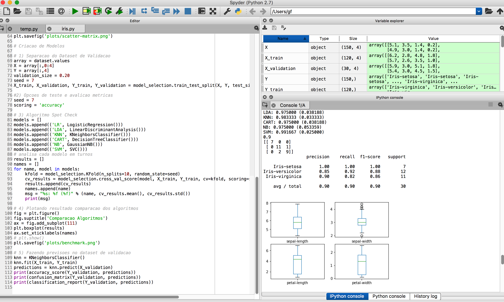

# [](https://hub.docker.com/r/gfreire) [](https://travis-ci.org) 
# 

### Machine Learning using the Python ecosystem
##### Classifiers: Logistic Regression , LDA, KNN, Decision Trees, Gaussian Naive Bayes, SVM 
##### *Presentation Link: https://g-freire.github.io/git-hub-pages/pt.html#*

## Steps to run:
### Using Docker:
#### Build images and run the containers 
```diff
+ $ docker-compose up -d
 ```
##### Plots outputs will be mounted at  */var/lib/docker/volumes/pythonml_benchmarks* on the host/VM path

##### Install the required dependencies and run the script
```diff
+ $ py iris.py
 ```

### You can also run via jupyter notebook:
```diff
+ $ jupyter notebook
 ```


##### Output should look like this :


