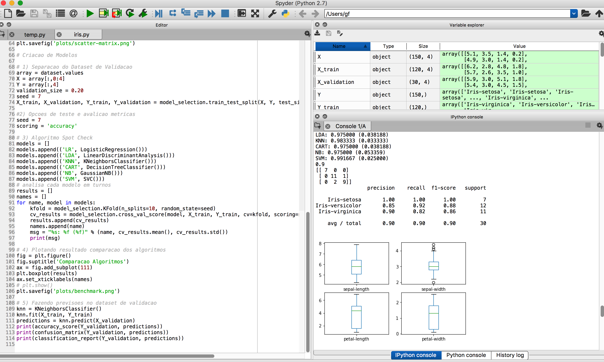

# [](https://hub.docker.com/r/gfreire) [](https://travis-ci.org) 
# 

###### Aprendizado de maquina usando linguagem Python 2.7.12 e Iris Data-set 
###### Classificadores testados: logistic regression , LDA, KNN, decision tree classifier, gaussian naive bayes, SVM 
##### *Link da apresentacao: https://g-freire.github.io/git-hub-pages/pt.html#*
#
#
## Steps to run:
### Using Docker:
#### Build images and run the containers 
```diff
+ $ docker-compose up -d
 ```
 ##### Plots outputs will be mounted at  */var/lib/docker/volumes/pythonml_benchmarks* on the host/VM path

### Using (Ana)Conda + Spyder IDE:  

##### Install the required dependencies using Anaconda and run the script using Spyder IDE 
##### Output should look like this :


